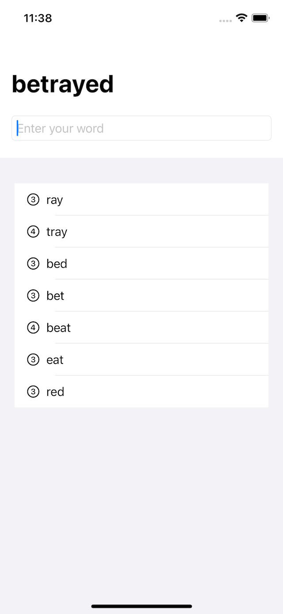
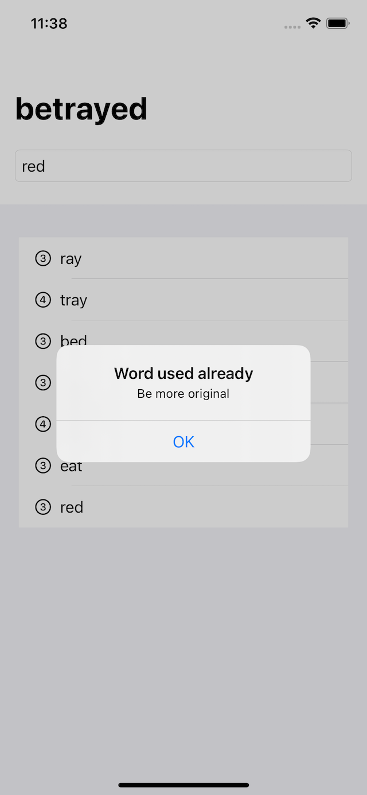
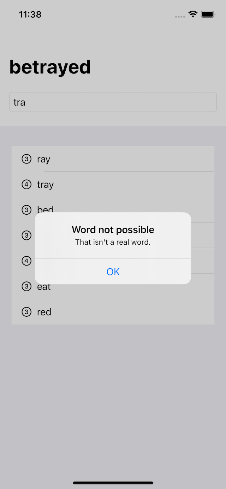
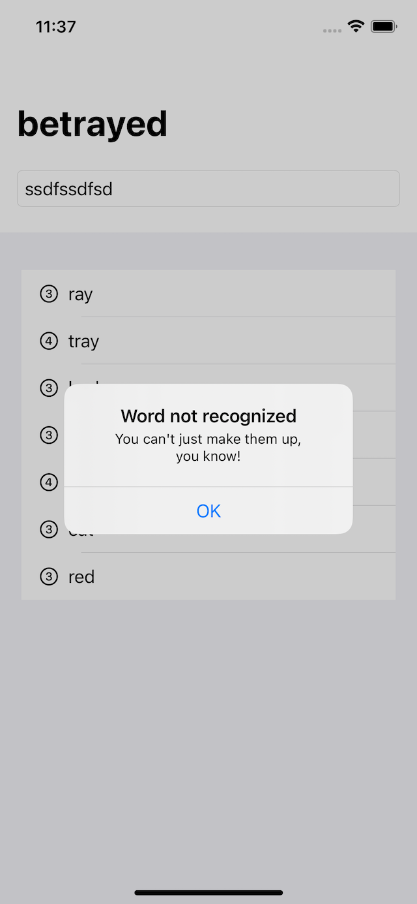

# Word Scramble (SwiftUI)

Show players a random eight-letter word, and ask them to make words out of it. For example, if the starter word is **alarming** they might spell *alarm*, *ring*, *main*, and so on.

## Screenshots

| Screenshot 01                  | Screenshot 02                  |
| ------------------------------ | ------------------------------ |
|  |  |

| Screenshot 03                  | Screenshot 04                  |
| ------------------------------ | ------------------------------ |
|  |  |

---

**MIT License**
